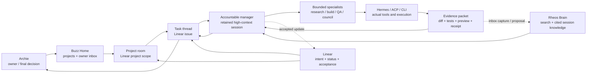

# Buzz Owner Workflow and First Pilot

Date: 2026-08-13  
Status: proposed from session, Linear and Rheos Brain evidence; owner approval required before implementation

## 1. Product answer

Buzz should not become another IDE, another Linear board or another knowledge database.

For Archie, Buzz should be the **project conversation, delegation and decision surface** over systems that already hold the truth:

```text
Linear        = what work exists, its owner, priority, blockers and acceptance
Rheos Brain   = current local durable knowledge, with session/source evidence
Rheos Library = intended semantic-canonical destination after reviewed drain
Hermes / ACP  = the sessions and harnesses that actually perform work
Agent Tower   = people/agent roles, capabilities, context revisions and receipts
Git / assets  = implementation and artifact evidence
Buzz          = project rooms, task conversations, delegation, checkpoints and replies
```

The daily experience should therefore be:

> Open a Linear-backed project room, speak to one accountable manager, let that manager delegate to bounded specialists, intervene only at meaningful checkpoints, and receive a compact evidence packet that links back to Linear, the execution session and cited Brain knowledge.

The Organization chart remains useful for staffing, policy and capacity. It should not be the primary daily task surface.

## 2. Evidence used

### Verified facts

- A fresh read-only audit on 2026-08-13 streamed 1,635 Claude transcript files and 447,000 JSONL records, deduplicating 91,178 assistant calls: 60.7% direct sessions, 26.7% subagents and 12.6% automation. One hundred parent sessions spawned 1,440 child transcripts; median fan-out was 7.5, 77% had overlapping child runs and median peak concurrency was three. These are audit-window call counts, not billing cost. Source: local Claude transcripts, independently summarized against `Rheos/Brain/sessions/2026-08-09-hermes-model-routing-and-engineering-team.md`.
- The user explicitly treats Sol and Claude Code as peer leads, with Terra/Luna/Sonnet-style workers used for bounded research, implementation, QA, extraction and routine checks. Source: the same session note.
- The user repeatedly requests independent challenge through Council, Codex, Muse, Grok or parallel agents, but expects one accountable synthesis rather than an unowned group answer. Sources: `Rheos/Brain/sessions/2026-08-11-agent-tower-3d-pipeline-council.md` and `Rheos/Brain/sessions/2026-08-09-hermes-model-routing-and-engineering-team.md`.
- The user interrupts and redirects quickly when a lane becomes overengineered, invisible or too abstract. The failed overnight Muse loop and the rejection of four simultaneous design variants are strong examples. Source: `Rheos/Brain/sessions/2026-08-11-muse-code-desktop-overnight-loop.md`.
- The user values concrete visible outcomes and often rejects backend-only progress that cannot yet be experienced in the product. Source: Hermes session `20260810_213238_1ea941` and its Brain-linked Agent Tower evidence.
- Linear already defines the intended contract: Linear is canonical task/evidence state; Buzz is communication/orchestration; workers return artifacts, tests, citations and receipts for manager disposition. Source: `docs/02-architecture/LINEAR-AND-BUZZ-DEPARTMENT-OPERATING-MODEL.md` and Linear issue `ALD-131`.
- Rheos Brain contract v2 makes sessions grounded evidence, hubs the knowledge spine and Linear the authority for tracked work. Working agents write inbox captures/proposals; the Librarian owns canonical session notes and publication. Source: `Rheos/Brain/AGENTS.md` and `Rheos/Brain/_meta/LIBRARIAN-AGENT-SYSTEM.md`.
- Rheos Library is the intended semantic-canonical destination, but the reviewed drain and full client/permission/retrieval parity are not yet proven; Buzz must not present that future state as live. Source: `Rheos/Brain/_meta/DRAIN-PLAN.md`, Brain session evidence and Linear `RHE-1527`/`RHE-1528`.
- Buzz access to Brain must use a separate expiring and revocable workload identity, not Archie's human OAuth/API/Nostr identity. Source: Linear `RHE-1528`.

### Interpretation

The user does not need Buzz to expose every model message or subagent call. That would reproduce transcript noise. The useful abstraction is **one accountable manager conversation with expandable evidence and specialist activity beneath it**.

### Unknowns to prove

- Whether a long-running Linear issue should use one Buzz thread or a temporary issue channel.
- Whether the first gateway should resume one existing Hermes lead session or create a dedicated project-manager session.
- The exact native UI for opening diffs, browser evidence and external session links.
- The minimum notification policy that keeps owner checkpoints visible without recreating background-process noise.

## 3. Whole-system usage map



## 4. The daily Buzz experience

### 4.1 Home: active projects and owner inbox

The default Buzz screen should answer only:

1. Which Linear projects are active?
2. Which tasks are running, blocked or waiting for Archie?
3. What changed since the last visit?
4. Which decision needs attention next?

The owner inbox should contain durable checkpoints, not every agent message:

- plan approval;
- ambiguity that changes the objective;
- new tool/knowledge/budget scope;
- public publishing, spend, merge, deploy or destructive action;
- manager-submitted evidence ready for acceptance;
- failed/degraded run needing redirection.

### 4.2 Project room: one stable conversation space per active Linear project

Use one long-lived project room for each Linear project that Archie deliberately activates in Buzz. Do not mirror every Linear project automatically, and do not create one project, team or permanent channel per agent. Paused/completed rooms become read-only or archived while their Linear and Brain links remain resolvable.

A project room displays:

- project outcome, status and milestone from Linear;
- accountable project manager/head;
- current issues and blockers;
- active and recently completed runs;
- relevant Brain hub and recent cited session evidence;
- latest accepted artifacts and decisions;
- the stable retained manager-session ID plus expandable worker-session IDs;
- a dominant composer for speaking to the manager.

For Agent Tower, the first room is tied to **Agent Tower — Buzz Organization Surface**, not to the entire initiative and not to a generic department chat.

The smallest useful initial channel set is:

```text
#owner-inbox     durable approvals, decisions and failures requiring Archie
#agent-tower     the Agent Tower — Buzz Organization Surface project room
#system-health   connector/context/receipt drift from System Manager
#council         material advisory requests with one accountable disposition
```

Do not create separate permanent channels for every specialist or model.

### 4.3 Task thread: one Linear issue is the work contract

A substantial request becomes or links to a Linear issue. The Buzz thread is the conversational projection of that issue.

The thread header shows:

- issue ID and outcome;
- project/milestone;
- manager and current worker;
- state: intake, planned, waiting for owner, delegated, evidence submitted, revision requested, verification, accepted, rejected or blocked;
- context revision;
- budget/deadline/tool scope;
- repository/worktree/branch and declared writer scope where applicable;
- concurrency budget and any shared-resource collision warning;
- Brain citations and execution-session link;
- retained lead-session ID and any bounded child-session IDs;
- evidence and manager disposition.

If a user message is genuinely exploratory, the manager may keep it as a short-lived conversation. Before it becomes substantial execution, the manager proposes the Linear issue or links an existing one.

### 4.4 Worker activity: visible but collapsed by default

Specialists should appear as bounded runs under the manager task, not as equal noisy chat participants.

Collapsed summary:

```text
2 specialists active · Research 70% · Reviewer waiting
```

Expanded evidence:

- exact worker role, runtime/provider/model and session ID;
- task envelope and permitted tools;
- declared repository/worktree/file scope and active-writer collisions;
- start time, budget and heartbeat;
- returned artifacts, tests, citations and uncertainty;
- failure or cancellation reason;
- execution receipt.

The user can stop, redirect or inspect a worker only when that control is genuinely connected and verified. Fake controls remain absent or explicitly disabled.

### 4.5 Session continuity and Brain filing

The project manager should retain one stable high-context session for the project until the owner deliberately replaces or archives it. Each delegated specialist receives a new bounded session linked to the parent task and manager session.

Every launched session carries safe filing metadata:

```text
linearProjectId
linearIssueId?
agentTowerTaskId
parentSessionId?
member/role ID
context revision
```

Buzz shows this lineage but does not copy whole transcripts. The Librarian uses the same IDs when compacting sessions into Brain, so a project hub can answer which manager and specialist sessions produced a decision without title matching.

Every paused, transferred or completed lane emits a compact resume capsule:

- current state and exact next action;
- decisions and sources already read;
- changed artifacts and verification;
- blockers, owner questions and stale-context warning;
- Linear, Brain, session and receipt handles.

## 5. Conversation and delegation protocol

```text
1. Archie writes in a project room or linked task thread.
2. The project manager resolves the Linear project/issue and current blockers.
3. Agent Tower assembles the current role, policy, tool and knowledge context.
4. The manager searches scoped Brain knowledge and cites the relevant project hub/session notes.
5. The manager proposes a compact plan or asks one material owner question.
6. After approval, the manager delegates bounded tasks to specialists in parallel only when independent.
7. Workers execute in Hermes/ACP/CLI workspaces, not inside the Buzz client itself.
8. Workers return artifacts, tests, citations, uncertainty and receipts.
9. The manager challenges/revises, runs verification and submits one evidence packet.
10. Archie accepts, rejects, redirects or requests revision in Buzz.
11. The manager updates Linear only after the disposition is known.
12. Durable learning becomes a Brain inbox capture/proposal; Buzz retains pointers and ephemeral thread state only.
```

This mirrors the user's real behavior: retained lead context, scoped fan-out, frequent steering, independent review and final accountable synthesis.

## 6. Rheos Brain behavior in Buzz

### Read path

A manager or worker receives only permission-scoped operations:

```text
search(query, project/scope filters)
get_document(id, version)
get_chunks(id, chunk IDs)
cite(id, version, chunk IDs)
```

For a project task, retrieval should prefer:

1. the project's Brain hub;
2. session notes linked from that hub;
3. current architecture/product notes;
4. exact Linear project/issue metadata;
5. broader company knowledge only when the grant and task require it.

The whole vault is never injected into a prompt. Personal/private scope never enters an organization task unless Archie explicitly selects it.

### Write path

Buzz agents do not directly rewrite canonical Brain hubs or session notes.

They may create:

- an inbox capture containing the completed decision/learning and source handles;
- a structured knowledge proposal with expected version and citations;
- a conflict/staleness report for Librarian review.

The nightly/hosted Librarian deduplicates, verifies and files. One guarded publisher applies approved semantic changes; Buzz must not introduce another concurrent writer. Buzz stores only the resulting knowledge ID/version and links.

### Identity boundary

Buzz Nostr identity, Agent Tower member identity and Rheos Brain workload identity remain separate. The Brain identity is profile-bound, expiring and revocable. `RHE-1528` is the canonical delivery item for proving this path.

## 7. Linear behavior in Buzz

Linear remains canonical. Buzz does not duplicate project or issue state into its own database as a competing authority.

Required mapping:

```text
Linear project ID ↔ Buzz project room ID
Linear issue ID   ↔ Agent Tower task ID ↔ Buzz thread/run ID
```

Only the accountable manager may submit status/evidence updates under policy. Workers do not self-close work.

Use saved views in the existing Linear team for:

- Engineering;
- Marketing;
- Operations & Finance;
- Knowledge & Data Centre;
- Leadership & People;
- System Health;
- Council Requests.

Do not create a Linear project per department, agent, model or channel. Projects remain durable outcomes.

## 8. Staffing model

### Stable roles

- **Archie:** owner, final approval and risk acceptance.
- **Project manager/head:** primary project conversation, scope validation, delegation, synthesis and acceptance recommendation.
- **Head of Engineering:** coding/repository tasks and engineering review.
- **Head of Marketing:** campaign/research work; initial public-content work is read-and-draft only.
- **Head of Operations & Finance:** operations and read-only financial analysis; no payment authority.
- **Head of Knowledge & Data Centre:** Brain retrieval, Librarian proposals, runtime/infrastructure evidence and retrieval quality.
- **System Manager:** connector, capability, context and receipt health; reports drift and never silently repairs or grants access.

### Ephemeral workers

Subagents, model panels and short-lived ACP/CLI sessions are execution resources. They should not automatically become permanent employees or organization-chart seats.

The project manager selects workers by task shape and risk. Model identity is recorded in the receipt, not encoded in the permanent role name or Linear title.

## 9. First pilot

### Pilot A — cited project concierge

Use the existing **System Manager** or **Head of Knowledge & Data Centre** in the Agent Tower project room.

Owner question:

> What did we decide about how Buzz, Linear and Brain divide responsibility, what is the current Linear state, and what is blocked?

Required path:

1. bind the Buzz sender and agent identity;
2. fetch current Agent Tower context;
3. search/get/cite only the Agent Tower Brain hub and linked session notes;
4. read the Agent Tower project and relevant issues from Linear without mutation;
5. return a concise cited answer, conflicts/staleness and an execution receipt;
6. create no canonical write.

Pass conditions:

- exact Brain citations open;
- live Linear status is distinguished from Brain narrative;
- no whole-vault or private-scope access;
- no shared human credential;
- failure/revocation is visible;
- response appears in the expected Buzz room and links the evidence.

Dependencies: `ALD-124`, `ALD-121`, and the Brain workload-identity proof in `RHE-1528`. `RHE-1528` is currently blocked by authenticated Claude/Codex parity in `RHE-1527`, which has its own Brain production prerequisites; Pilot A must remain visibly blocked until those gates pass.

### Pilot B — one Engineering issue through manager review

After Pilot A passes, select one small existing Agent Tower Engineering issue and prove:

```text
Linear issue
→ Head of Engineering validates
→ current context + cited Brain evidence
→ one implementer + one independent reviewer
→ diff/tests/preview/receipt
→ manager disposition
→ Archie accepts or requests revision
→ Linear read-back
```

No auto-merge, deploy or issue closure.

## 10. UX principles derived from observed use

- **One dominant manager conversation, not a dashboard wall.**
- **One selected design, not several cosmetic variants.**
- **Show visible outcomes early.** Do not lead with invisible backend machinery.
- **Collapse worker chatter; expose evidence on demand.**
- **Owner checkpoints are first-class durable state.**
- **Stop/redirect must be immediate and honest.**
- **Use exact status language:** local, committed, pushed, merged, packaged, released.
- **Do not notify for every subprocess or background completion.** Notify only for owner action, material failure or accepted completion.
- **Every progress summary uses plain language:** what changed, what is proven, what remains blocked and the next owner decision.
- **No fake progress or fake controls.** Scheduled/running/claimed completion are distinct.
- **Links return to the right review surface:** Linear for task state, PR/IDE for code, preview/browser for UI, Brain for knowledge and Agent Tower for permissions/receipts.

## 11. Confirmed, proposed and deferred

### Confirmed

- Linear is canonical work/evidence state.
- Brain is durable knowledge; sessions are evidence and hubs are the spine.
- Buzz is communication/delegation/checkpoint infrastructure.
- Harnesses execute tools; Buzz itself does not become the IDE or tool host.
- Stable managers plus bounded specialist runs match the user's observed workflow.
- Owner review and manager disposition remain mandatory for consequential work.

### Proposed

- Project rooms keyed to active Linear projects.
- Task threads keyed to Linear issues.
- A single owner inbox containing only durable checkpoints.
- Collapsed worker activity with expandable receipts/evidence.
- Cited project concierge as the first useful Brain-backed Buzz pilot.

### Deferred

- One channel per issue as a default.
- Autonomous Linear writes or issue closure.
- Direct canonical Brain publication by unattended agents.
- Broad cross-project memory in Buzz.
- Automatic merge/deploy/publish/spend.
- Permanent employee identities for every subagent/model invocation.

## 12. Tracking and immediate sequence

Use existing work rather than creating another project:

1. **`ALD-119`** — retain as the planning/runtime-host and manager/worker operating-model issue.
2. **`ALD-124`** — finish the versioned context and scoped Brain path.
3. **`ALD-121`** — keep the bounded native Buzz round-trip proof current.
4. **`RHE-1528`** — prove a separate revocable read-only Brain identity for Buzz.
5. **`ALD-131`** — make this document the product/UX evidence for the Linear-to-Buzz execution contract and run Pilot A, then Pilot B.

Implementation reference: `https://github.com/0xtsotsi/buzz-mcp` demonstrates a typed Nostr-over-MCP surface and informs the read/search/subscription/message tool grammar. Its current package is reference-only—not an installable dependency—because it targets CorePrt, accepts a raw operator private key, lacks Agent Tower session/permission binding, and has write-gate, signed-preview, test/typecheck, dependency and distribution blockers documented in `../02-architecture/BUZZ-WORKSPACE-HERMES-MESSAGING-AND-AGENTS.md`.

Do not create a new Linear project. The correct project remains **Agent Tower — Buzz Organization Surface**.

## 13. Evidence references

- `Rheos/Brain/AGENTS.md`
- `Rheos/Brain/_meta/LIBRARIAN-AGENT-SYSTEM.md`
- `Rheos/Brain/_meta/LINEAR-MAP.md`
- `Rheos/Brain/vault/projects/agent-tower.md`
- `Rheos/Brain/sessions/2026-08-09-hermes-model-routing-and-engineering-team.md`
- `Rheos/Brain/sessions/2026-08-09-buzz-department-capability-matrix.md`
- `Rheos/Brain/sessions/2026-08-11-agent-tower-3d-pipeline-council.md`
- `Rheos/Brain/sessions/2026-08-11-muse-code-desktop-overnight-loop.md`
- `docs/02-architecture/LINEAR-AND-BUZZ-DEPARTMENT-OPERATING-MODEL.md`
- `https://github.com/0xtsotsi/buzz-mcp` at audited commit `83f6aa5d57ce7718dcce883708f4b14c13ae6a6f`
- Linear `ALD-119`, `ALD-121`, `ALD-124`, `ALD-131`, and `RHE-1528`
